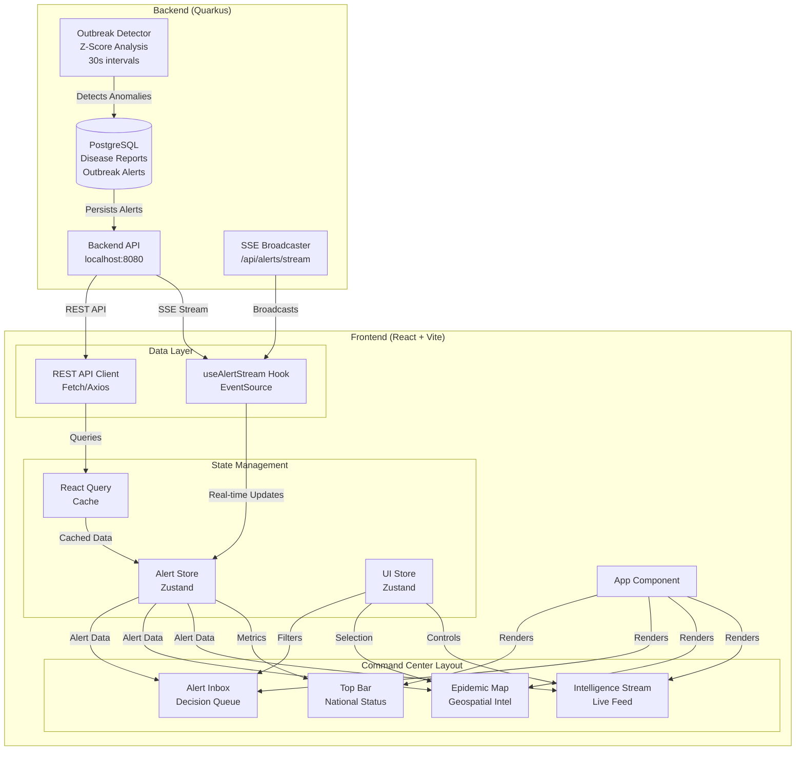
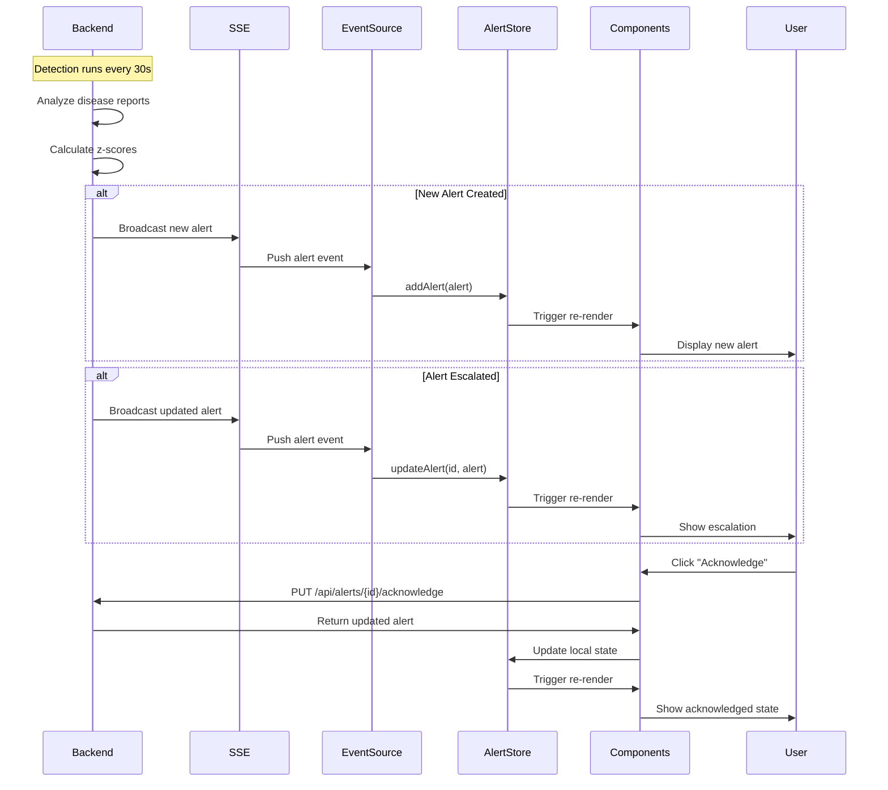
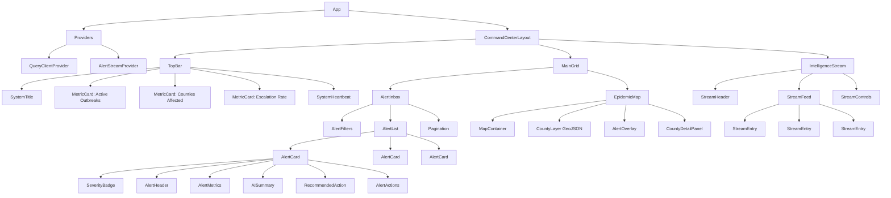
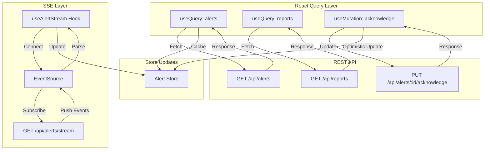
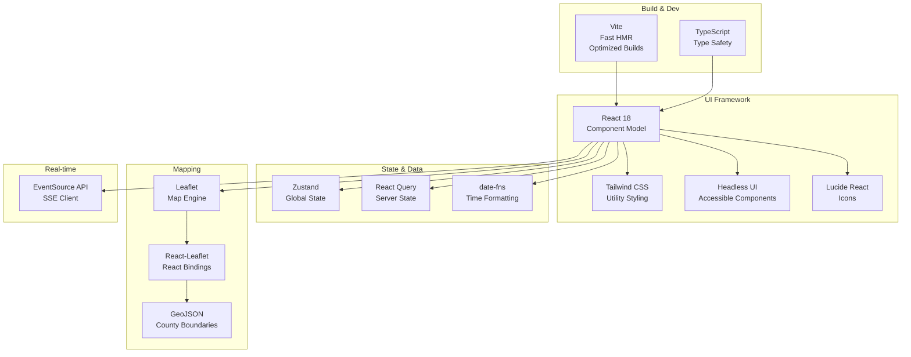
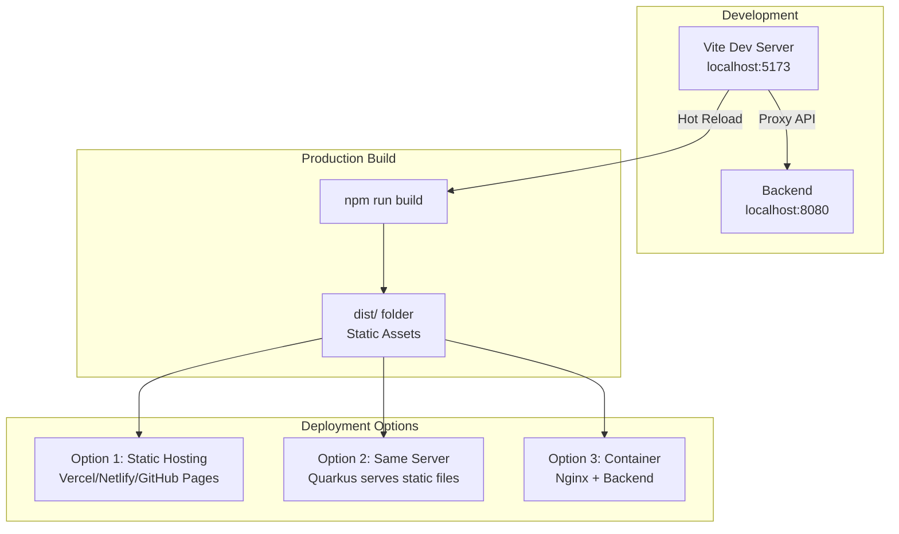
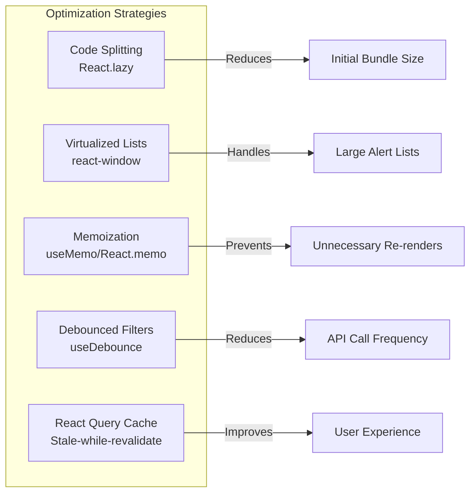

# EpidemiWatch Frontend Architecture Diagram

## System Overview



## Data Flow Architecture



## Component Hierarchy



## State Management Flow

```mermaid
graph LR
    subgraph "Alert Store (Zustand)"
        ALERTS[alerts: OutbreakAlert[]]
        COUNT[unacknowledgedCount: number]
        ACTIONS[Actions:<br/>setAlerts<br/>addAlert<br/>updateAlert<br/>acknowledgeAlert]
        COMPUTED[Computed:<br/>getAlertsByCounty<br/>getAlertsBySeverity<br/>getActiveOutbreakCount]
    end
    
    subgraph "UI Store (Zustand)"
        COUNTY[selectedCounty: string]
        SEVERITY[severityFilter: string[]]
        ACK[acknowledgedFilter: boolean]
        PAUSE[streamPaused: boolean]
        UI_ACTIONS[Actions:<br/>setSelectedCounty<br/>toggleSeverityFilter<br/>setAcknowledgedFilter<br/>toggleStreamPause]
    end
    
    subgraph "Components"
        INBOX_COMP[AlertInbox]
        MAP_COMP[EpidemicMap]
        STREAM_COMP[IntelligenceStream]
        TOP_COMP[TopBar]
    end
    
    ALERTS --> INBOX_COMP
    ALERTS --> MAP_COMP
    ALERTS --> STREAM_COMP
    ALERTS --> TOP_COMP
    
    SEVERITY --> INBOX_COMP
    ACK --> INBOX_COMP
    COUNTY --> MAP_COMP
    PAUSE --> STREAM_COMP
    
    INBOX_COMP -->|User filters| UI_ACTIONS
    MAP_COMP -->|User clicks county| UI_ACTIONS
    STREAM_COMP -->|User pauses| UI_ACTIONS
```

## API Integration Pattern



## 4-Panel Layout Structure

```mermaid
graph TD
    subgraph "Command Center Layout"
        subgraph "Top Bar - h-16"
            TB[National Health Surveillance Status<br/>System Title | Active Outbreaks | Counties Affected | Escalation Rate | Heartbeat]
        end
        
        subgraph "Main Grid - flex-1"
            subgraph "Left Panel - w-1/3"
                LP[Alert Inbox<br/>Decision Queue<br/>Filters | Alert Cards | Pagination]
            end
            
            subgraph "Right Panel - w-2/3"
                RP[Epidemic Map<br/>Geospatial Intelligence<br/>Kenya Counties | Alert Overlay | Interactions]
            end
        end
        
        subgraph "Bottom Panel - h-48"
            BP[Intelligence Stream<br/>Live Feed<br/>Auto-scroll | Event Entries | Controls]
        end
    end
    
    TB -.->|Metrics from| LP
    TB -.->|Metrics from| RP
    LP -.->|Synced with| RP
    BP -.->|Events from| LP
    BP -.->|Events from| RP
```

## Mobile Responsive Transformation

```mermaid
graph TB
    subgraph "Desktop Layout > 1024px"
        D_TOP[Top Bar - Full Metrics]
        D_LEFT[Alert Inbox - 33%]
        D_RIGHT[Map - 67%]
        D_BOTTOM[Stream - Fixed Height]
    end
    
    subgraph "Tablet Layout 768-1024px"
        T_TOP[Top Bar - Collapsed Metrics]
        T_STACK[Stacked Layout<br/>Alert Inbox Full Width<br/>Map Full Width]
        T_DRAWER[Stream - Slide-up Drawer]
    end
    
    subgraph "Mobile Layout < 768px"
        M_TOP[Top Bar - Minimal]
        M_TABS[Tab Navigation<br/>Alerts | Map | Stream]
        M_ACTIVE[Active Panel - Full Width]
    end
    
    D_TOP -->|Breakpoint 1024px| T_TOP
    T_TOP -->|Breakpoint 768px| M_TOP
    
    D_LEFT -->|Stack| T_STACK
    D_RIGHT -->|Stack| T_STACK
    T_STACK -->|Tabs| M_TABS
    
    D_BOTTOM -->|Drawer| T_DRAWER
    T_DRAWER -->|Tab| M_TABS
```

## Technology Stack Integration



## Deployment Architecture



---

## Key Architecture Decisions

### 1. State Management: Zustand over Redux
**Rationale**: Lightweight, TypeScript-friendly, minimal boilerplate. Perfect for real-time alert updates without complex middleware.

### 2. Data Fetching: React Query + SSE
**Rationale**: React Query handles REST caching/refetching. Native EventSource for SSE keeps it simple and reliable.

### 3. Mapping: Leaflet over Google Maps
**Rationale**: Open-source, no API keys, excellent GeoJSON support, lightweight.

### 4. Styling: Tailwind CSS
**Rationale**: Rapid development, consistent design system, excellent responsive utilities.

### 5. Build Tool: Vite over CRA
**Rationale**: 10x faster HMR, optimized production builds, modern ESM-based architecture.

---

## Performance Considerations



---

**Document Status**: ✅ Architecture Defined  
**Last Updated**: 2026-05-02  
**Author**: Bob (Plan Mode)